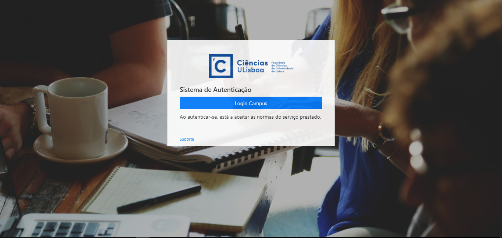

## Auth

For authentication purposes in our application, *Google Firebase* is utilized in order to simulate the *CAS* authentication used by FCUL. The users must login through their pre-existing *Gmail* Account.

## User Types

The application is aimed towards several different types of users within the same institution, each with specific needs and clearances for the use of features specific to their roles. The final user types were chosen to reflect this very separation.

There are five types of users:

- Student
- Professor
- ​Staff Member
- Security
- Admin

---

# Dashboard

Accessed by the route `/dashboard`, this is the initial page of the application. It shows generic user information and provides easy access to other information.

---

# Consultar Histórico

Accessed by the route `/historico`, it allows a user to view all their access records. The information can be filtered by building, floor and/or room, and date, and returns the timeframes during which each room was accessed.

---

# Salas Disponíveis

Accessed by the route `/salas`, it allows a user to view the available classrooms for potential use. The information can be filtered by building and floor, and will return a listing of free classrooms within the parameters as well as their respective number of seats.

---

# Consultar Presenças

Accessed by the route `/presencas`, it allows a professor to view their classes' attendance records. The information can be filtered by class, room, date, and student, and returns the student information for the selected class.

---

# Alterar Presenças

Accessed by the route `/alt-presencas`, it allows a staff member to change class attendance records for individual students. This requires the class information to be provided, as well as the date and the student's information.

---

# Consultar Espacos

Accessed by the route `/espacos`, it allows the security members and the administrator to verify how many people are present in a specific room. The information can be filtered by date and user.

---

# Criar Acessos

Accessed by the route `/criar-acessos`, it allows the security members and the administrator to create a temporary user access for someone that is not in the database. This requires the personal information of the visitor as well of the person responsible for their visit, their contact information, and other data relevant to the access such as the reason for the visit and the timeframe the temporary access will be valid for.

---

# Acidentes

Accessed by the route `/acidentes`, it allows the security members and the administrator to control and create events for possible and past accidents or catastrophes. To create an incident event, they must provide the type, date, location, and description of the disaster. Past events can be filtered by type, beginning and ending dates, and location. 

---

# Admin

Accessed by the route `/admin`, this page allows the administrator to change the type of another user. The administrator provides the email of the user, prompting the page to return that user's information for confirmation purposes.

---